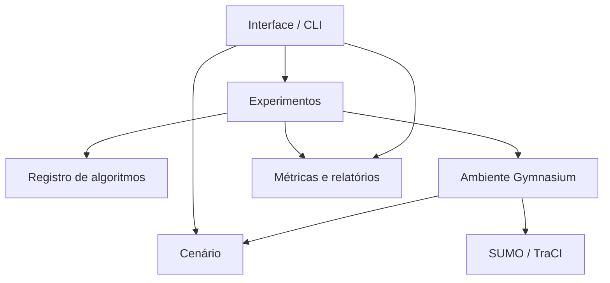

# Arquitetura do projeto

## Responsabilidades

| Camada | Local | Responsabilidade |
| --- | --- | --- |
| Cenário | semaforos/cenario | Ler e validar configuração, rede, demanda, medições e mapeamento. |
| Simulação | semaforos/simulacao | Executar SUMO/TraCI e expor observações, ações, recompensa e métricas via Gymnasium. |
| Algoritmos | semaforos/algoritmos | Construir/carregar o algoritmo escolhido, heurísticas e busca de tempos fixos. |
| Experimentos | semaforos/experimentos | Treinar, salvar, cancelar, avaliar nas mesmas condições e registrar proveniência. |
| Relatórios | semaforos/relatorios | Agregar métricas, emitir arquivos/gráficos e fornecer legendas/catálogos. |
| Apresentação | semaforos/apresentacao | Editar cenário, iniciar processos e exibir/exportar resultados. |



PPO conhece o ambiente pela interface Gymnasium. experimentos/rl.py compartilha treino, salvamento, cancelamento e avaliação. algoritmos/heuristicas.py mantém a referência de filas fora do PPO. Configurações do construtor são definidas uma única vez em algoritmos/ppo.py e usadas pelo treino e catálogo.

caminhos.PROJECT_ROOT evita que mudanças de pasta alterem a localização de dados e configurações. pipeline.py e interface.py são entradas pequenas e preservam os comandos usados pelo usuário. Os caminhos de importação internos foram migrados; scripts externos que importavam módulos antigos precisam usar os novos caminhos.

## Acrescentar outro algoritmo de aprendizado

O adaptador Algorithm é para modelos compatíveis com o ciclo Stable-Baselines3: construtor com env, learn(total_timesteps, callback), predict(observation, deterministic), save, load, num_timesteps e device. O ambiente atual usa observações Box e ações **MultiDiscrete**. Um algoritmo com espaço de ações diferente exige um adaptador do ambiente e testes adicionais.

Exemplo de um novo adaptador A2C, para implementação futura:

```python
# semaforos/algoritmos/a2c.py
from stable_baselines3 import A2C
from .registro import Algorithm

def constructor_parameters(config):
    params = config.get("a2c", {})
    return dict(policy="MlpPolicy", n_steps=int(params.get("n_steps", 128)),
                seed=config["seeds"][0], verbose=0)

A2C_ALGORITHM = Algorithm("A2C", A2C, "a2c", constructor_parameters)
```

Na função _ensure_builtins de registro.py, importar e registrar uma vez o adaptador, de modo semelhante ao PPO. O registro explícito impede carregar código arbitrário a partir do JSON. Selecionar algorithm: "A2C" no cenário e criar a2c: {"n_steps": 128, "total_timesteps": 2048}. Na interface, o seletor mostra os algoritmos registrados; parâmetros específicos são informados no campo JSON. Criar também as legendas correspondentes para campos novos.

```python
# Acrescentar dentro de _ensure_builtins, após o registro PPO:
if "A2C" not in _ALGORITHMS:
    from .a2c import A2C_ALGORITHM
    register_algorithm(A2C_ALGORITHM)
```

```powershell
.\.venv\Scripts\python.exe pipeline.py algorithms
.\.venv\Scripts\python.exe pipeline.py rl-train --algorithm A2C --config config/meu_cenario.json
.\.venv\Scripts\python.exe pipeline.py rl-eval --algorithm A2C --model resultados/PASTA/a2c_model.zip
```

Esses comandos A2C passam a funcionar **após implementar e registrar** o adaptador. Só PPO é publicado nesta revisão. O teste de integração registra A2C temporariamente e executa o mesmo fluxo para comprovar a extensão, sem disponibilizá-lo como produto.

Os controles comuns podem ficar em control: intervalo de decisão, modo, tipos de fase, limites, opções por fase e GUI. Arquivos existentes que mantêm esses campos em ppo continuam aceitos. Os hiperparâmetros do otimizador ficam na chave de seu adaptador. Manifestos PPO antigos e ppo_model.zip continuam aceitos quando rede, mapeamento e espaço de ações são compatíveis.

## Outros métodos de otimização

Algoritmos que procuram tempos fixos, como busca aleatória ou métodos evolutivos, usam simulacao/execucao.py::simulate com um candidato por ID:índice. A implementação existente fica em algoritmos/busca_surrogate.py; recebe cenário e diretório de resultados. Esses métodos têm outro ciclo de otimização e precisam de integração própria ao CLI/UI; o registro de modelos RL não os transforma automaticamente em agentes Gymnasium.

O reaproveitamento é de rede, demanda, coleta e avaliação SUMO. Métodos que mudam observações, ações, sequência de fases ou recompensa precisam testar esses contratos e treinar novos modelos.

## Limpeza realizada

Removidos arquivos duplicados/obsoletos: ajuda estática opcoes_sumo_1.27.1.txt, template estático modelo_todas_opcoes.sumocfg, gerador antigo gerar_catalogo_sumo.py e script pontual verificar_relatorios_catalogos.py, que dependia de um experimento datado e reescrevia resultados históricos. O exportador atual gera CSV e Markdown diretamente da instalação. A migração temporária também foi removida.

Os antigos módulos planos foram movidos para as camadas; não há cópias duplicadas. A busca antiga permanece disponível porque tem implementação e comando ativos. Redes, fontes, medições, evidências, modelos e resultados anteriores são preservados. A limpeza de caches é limitada ao código do projeto, sem alterar .venv ou .git.
