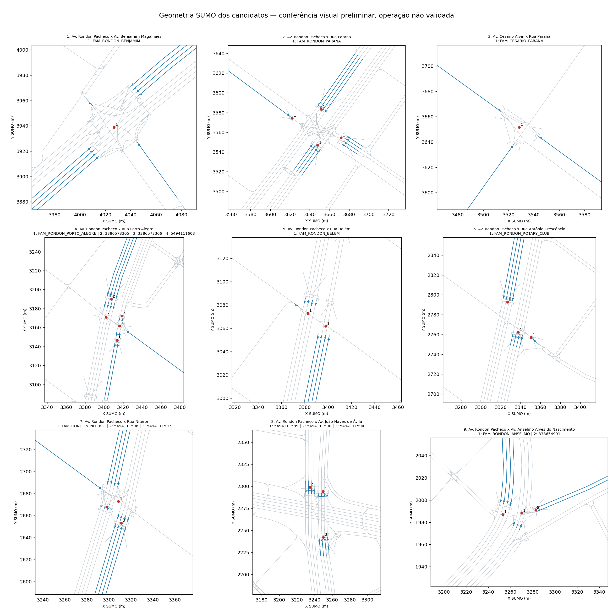

# Conferência visual dos nove cruzamentos — Rondon Norte

Consulta: 2026-10-06. Rede: `dados/rede/uberlandia.rondon_norte_corrigida.net.xml`.

Foram examinados mapa e panoramas dos nove locais. Esta é uma conferência preliminar de localização e elementos visíveis. Não houve levantamento completo de todas as aproximações, focos ou permissões. A programação e os tempos não podem ser confirmados por fotografias.

As coordenadas de busca de sete locais vieram da rede SUMO: são um meio de localizar candidatos, não uma confirmação independente. A correspondência foi confrontada com nomes das ruas no mapa/panorama. Benjamim e Paraná foram encontrados por busca nominal.

As conexões, quantidades de faixas e estados abaixo são do XML SUMO. Os IDs numéricos/FAM não foram confirmados como códigos oficiais de controladores físicos.

## Resultado

- 9 locais com imagem examinada; 0 cruzamentos plenamente validados.
- 17 candidatos inventariados, incluindo conexões de pedestres.
- Porto Alegre: captura de setembro de 2019 no ponto consultado; precisa de atualização em campo ou outro panorama recente.
- João Naves: viaduto e acessos laterais exigem distinguir níveis e movimentos.
- Anselmo: nome público dos Santos diverge de do Nascimento na chave legada; possível divergência de faixas precisa de conferência específica.

## Problemas da rede corrigida

O inventário consulta o programa ativo ao iniciar o SUMO apenas com esta rede, sem arquivo adicional ou ação externa. Isso não descreve necessariamente uma execução que carregue programas adicionais.

Seis candidatos FAM têm programas veiculares em estado `O`, embora as imagens mostrem equipamentos semafóricos nesses locais. `O` significa sinal desligado com passagem por prioridade; não é verde e não significa que os veículos estejam permanentemente parados. [Documentação SUMO](https://sumo.dlr.de/docs/Simulation/Traffic_Lights.html).

Há 16 candidatos com índices permanentemente vermelhos neste programa; as conexões correspondentes são de travessias de pedestres. Isso é uma lacuna do modelo, mesmo que a demanda atual não inclua pessoas. Não criar fases de pedestres sem conferir conflitos e tempos.

| Candidato | Programa inicial | Índices sempre desligados | Índices sempre vermelhos |
|---|---|---|---|
| `FAM_RONDON_BENJAMIM` | `current` | 0, 1, 2, 3, 4, 5, 6, 7, 8, 9, 10, 11, 12, 13, 14, 15, 16, 17 | 18, 19, 20, 21, 22, 23 |
| `FAM_RONDON_PARANA` | `1624` | — | 11, 12, 13, 14 |
| `FAM_CESARIO_PARANA` | `current` | 0, 1, 2, 3, 4 | 5, 6, 7 |
| `FAM_RONDON_PORTO_ALEGRE` | `current` | 0, 1, 2, 3, 4, 5, 6, 7, 8, 9 | 10, 11 |
| `3386573305` | `0` | — | 4 |
| `3386573306` | `0` | — | 2 |
| `5494111603` | `0` | — | 2 |
| `FAM_RONDON_BELEM` | `current` | 0, 1, 2, 3, 4, 5, 6, 7, 8, 9 | — |
| `FAM_RONDON_ROTARY_CLUB` | `1624` | — | 9, 10, 11 |
| `FAM_RONDON_NITEROI` | `current` | 0, 1, 2, 3, 4, 5, 6, 7, 8, 9, 10, 11, 12, 13, 14, 15, 16 | 17, 18 |
| `5494111596` | `0` | — | 4 |
| `5494111597` | `0` | — | 4 |
| `5494111589` | `0` | — | 4 |
| `5494111590` | `0` | — | 5 |
| `5494111594` | `0` | — | 4 |
| `FAM_RONDON_ANSELMO` | `current` | 0, 1, 2, 3, 4, 5, 6, 7 | 8, 9 |
| `338654991` | `0` | — | 2 |

## Geometria do modelo



Figura extraída do XML; não é imagem do Google nem comprova a geometria real. As linhas são faixas, os pontos indicam nós associados aos IDs candidatos e as setas indicam sentido das faixas de entrada. Os diferentes níveis de viadutos não são representados por altura nesta figura.

## 1. Av. Rondon Pacheco x Av. Benjamim Magalhães

Identificação pública: **Av. Rondon Pacheco & Av. Benjamin Magalhães**. Captura: **2025-08**. [Panorama consultado](https://www.google.com/maps/@?api=1&map_action=pano&pano=F_zTpbQu8sJiN5CXk_Q3nA&heading=137.56).

Correspondência espacial: compatível preliminarmente.

Observações:

- Cruzamento em nível com ilhas/canteiros e mais de uma pista da Rondon.
- Focos veiculares suspensos visíveis em ambos os lados do enquadramento.
- Travessia zebrada na aproximação oposta.

Limitações e pendências:

- Uma perspectiva não permite contar todas as faixas nem identificar todos os focos de pedestres.
- Grafia Benjamin no Maps difere de Benjamim no projeto.

Inventário do modelo:

| TLS candidato | Arestas de entrada externas: ID (faixas) | Conexões totais |
|---|---|---|
| `FAM_RONDON_BENJAMIM` | `1156717163#3` (4); `152937136#3` (4); `666324302#5` (1); `853751181#0` (1) | 24 |

Pendente: relacionar individualmente cada faixa e movimento ao foco real, identificar todas as travessias e completar o diagrama de estágios com fonte operacional. As marcas `controlled_links_verified`, `movements_verified`, `pedestrians_verified` e `safety_verified` permanecem falsas.

## 2. Av. Rondon Pacheco x Rua Paraná

Identificação pública: **Av. Rondon Pacheco & R. Paraná**. Captura: **2025-06**. [Panorama consultado](https://www.google.com/maps/@?api=1&map_action=pano&pano=dEHFs2HaX00qNKbjBCVf7g&heading=34.63).

Correspondência espacial: compatível preliminarmente.

Observações:

- Travessia zebrada na Rondon e canteiro central visíveis.
- Foco veicular suspenso e foco junto à calçada visíveis.
- Mais de uma coluna de veículos na aproximação; veículos ocultam parte da demarcação.

Limitações e pendências:

- Não inferir quantidade exata de faixas pela posição dos veículos.
- Não confirma atendimento de pedestres, sincronismo dos focos ou prioridade de emergência.

Inventário do modelo:

| TLS candidato | Arestas de entrada externas: ID (faixas) | Conexões totais |
|---|---|---|
| `FAM_RONDON_PARANA` | `1156272393#6` (4); `1156717168` (4); `1156717173#4` (4); `901328279#0` (1) | 15 |

Pendente: relacionar individualmente cada faixa e movimento ao foco real, identificar todas as travessias e completar o diagrama de estágios com fonte operacional. As marcas `controlled_links_verified`, `movements_verified`, `pedestrians_verified` e `safety_verified` permanecem falsas.

## 3. Av. Cesário Alvin x Rua Paraná

Identificação pública: **Av. Cesário Alvim / R. Paraná**. Captura: **2025-07**. [Panorama consultado](https://www.google.com/maps/@?api=1&map_action=pano&pano=ZtCTxB0BC5RXGpjjjn_dUA&heading=97.46).

Correspondência espacial: compatível preliminarmente.

Observações:

- Nome Av. Cesário Alvim aparece na sobreposição da imagem; cabeçalho indica 148 R. Paraná.
- Travessias zebradas e ilha/canteiro estreito no cruzamento.
- Foco suspenso visível, com parte da sinalização ocultada por árvores e veículos.

Limitações e pendências:

- Busca nominal retornou estabelecimentos; localização conferida por coordenadas SUMO, ruas no mapa e panorama.
- Grafia Alvin do projeto difere de Alvim no Maps.
- Conversões permitidas e grupos de pedestres não confirmados.

Inventário do modelo:

| TLS candidato | Arestas de entrada externas: ID (faixas) | Conexões totais |
|---|---|---|
| `FAM_CESARIO_PARANA` | `154252437#1` (1); `602306713#21` (1); `665897556#1` (1) | 8 |

Pendente: relacionar individualmente cada faixa e movimento ao foco real, identificar todas as travessias e completar o diagrama de estágios com fonte operacional. As marcas `controlled_links_verified`, `movements_verified`, `pedestrians_verified` e `safety_verified` permanecem falsas.

## 4. Av. Rondon Pacheco x Rua Porto Alegre

Identificação pública: **Av. Rondon Pacheco / R. Porto Alegre**. Captura: **2019-09**. [Panorama consultado](https://www.google.com/maps/@?api=1&map_action=pano&pano=PPIfrg6fppt6gKtStnBxdg&heading=284.33).

Correspondência espacial: compatível preliminarmente.

Observações:

- Mapa mostra encontro da Rondon com Rua Porto Alegre no ponto candidato.
- Ilha/canteiro largo e acesso transversal visíveis; equipamento semafórico na lateral direita.

Limitações e pendências:

- Capturas listadas neste ponto: setembro/agosto de 2019, dezembro de 2015, agosto de 2013 e agosto de 2011.
- Imagem antiga não comprova configuração vigente em 2026.
- Quatro IDs candidatos não significam quatro controladores físicos confirmados.

Inventário do modelo:

| TLS candidato | Arestas de entrada externas: ID (faixas) | Conexões totais |
|---|---|---|
| `FAM_RONDON_PORTO_ALEGRE` | `299471494#2` (2); `30664532#2` (1); `331577748#4` (4) | 12 |
| `3386573305` | `331577748#2` (4) | 5 |
| `3386573306` | `299471494#1` (2) | 3 |
| `5494111603` | `1156717170#0` (2) | 3 |

Pendente: relacionar individualmente cada faixa e movimento ao foco real, identificar todas as travessias e completar o diagrama de estágios com fonte operacional. As marcas `controlled_links_verified`, `movements_verified`, `pedestrians_verified` e `safety_verified` permanecem falsas.

## 5. Av. Rondon Pacheco x Rua Belém

Identificação pública: **Av. Rondon Pacheco / R. Belém**. Captura: **2025-02**. [Panorama consultado](https://www.google.com/maps/@?api=1&map_action=pano&pano=hdX7avQU9JQLgUCi6HJaaA&heading=285.51).

Correspondência espacial: compatível preliminarmente.

Observações:

- Rua Belém identificada no cabeçalho e na sobreposição da imagem.
- Foco suspenso, ilha/canteiro central e acesso transversal visíveis.
- Demarcações separadoras de faixas na Rondon visíveis.

Limitações e pendências:

- Travessia zebrada e foco específico de pedestres não identificados neste enquadramento; isso não comprova ausência.
- Parte da aproximação está ocupada por veículos; contagem completa de faixas e permissões pendente.

Inventário do modelo:

| TLS candidato | Arestas de entrada externas: ID (faixas) | Conexões totais |
|---|---|---|
| `FAM_RONDON_BELEM` | `331577750#1` (4); `576876311#3` (4); `965367673#0` (1) | 10 |

Pendente: relacionar individualmente cada faixa e movimento ao foco real, identificar todas as travessias e completar o diagrama de estágios com fonte operacional. As marcas `controlled_links_verified`, `movements_verified`, `pedestrians_verified` e `safety_verified` permanecem falsas.

## 6. Av. Rondon Pacheco x Rua Antônio Crescêncio

Identificação pública: **Av. Rondon Pacheco / R. Antônio Crescêncio / R. Rotary Club**. Captura: **2025-06**. [Panorama consultado](https://www.google.com/maps/@?api=1&map_action=pano&pano=ta4qAC9p7sXwpSLWG80Z_Q&heading=227.43).

Correspondência espacial: compatível preliminarmente.

Observações:

- Mapa mostra Antônio Crescêncio a oeste e Rotary Club a leste da Rondon, na região dos nós do candidato FAM_RONDON_ROTARY_CLUB.
- Focos suspensos e laterais visíveis; canteiro central, ilhas e marcas separadoras de faixas.

Limitações e pendências:

- Compatibilidade espacial não comprova que todos os focos pertencem ao mesmo controlador físico.
- Veículo encobre parte do cruzamento; conversões e grupos de pedestres pendentes.

Inventário do modelo:

| TLS candidato | Arestas de entrada externas: ID (faixas) | Conexões totais |
|---|---|---|
| `FAM_RONDON_ROTARY_CLUB` | `463014795#0` (1); `930831033#0` (4); `965367672#2` (4) | 12 |

Pendente: relacionar individualmente cada faixa e movimento ao foco real, identificar todas as travessias e completar o diagrama de estágios com fonte operacional. As marcas `controlled_links_verified`, `movements_verified`, `pedestrians_verified` e `safety_verified` permanecem falsas.

## 7. Av. Rondon Pacheco x Rua Niterói

Identificação pública: **Av. Rondon Pacheco / R. Niterói**. Captura: **2025-01**. [Panorama consultado](https://www.google.com/maps/@?api=1&map_action=pano&pano=wR00VHCIofOm7zsDqvSXGg&heading=93.72).

Correspondência espacial: compatível preliminarmente.

Observações:

- Rua Niterói identificada na sobreposição do panorama.
- Canteiro/ilhas separando pistas e aproximações visíveis.
- Pedestres atravessando a aproximação oposta; equipamentos semafóricos visíveis nas laterais.

Limitações e pendências:

- Travessia observada não comprova liberação semafórica nem conformidade dos tempos de pedestres.
- Três IDs candidatos precisam de correspondência individual com cada travessia/foco.

Inventário do modelo:

| TLS candidato | Arestas de entrada externas: ID (faixas) | Conexões totais |
|---|---|---|
| `FAM_RONDON_NITEROI` | `30622933#11` (1); `930831032#1` (4); `931572689` (4) | 19 |
| `5494111596` | `1156717175#0` (4) | 5 |
| `5494111597` | `930831032#0` (4) | 5 |

Pendente: relacionar individualmente cada faixa e movimento ao foco real, identificar todas as travessias e completar o diagrama de estágios com fonte operacional. As marcas `controlled_links_verified`, `movements_verified`, `pedestrians_verified` e `safety_verified` permanecem falsas.

## 8. Av. Rondon Pacheco x Av. João Naves de Ávila

Identificação pública: **Viaduto João Naves Rondon e acessos laterais**. Captura: **2025-11**. [Panorama consultado](https://www.google.com/maps/@?api=1&map_action=pano&pano=nSnHt5r83CQ1v5FJdpwTpw&heading=351.45).

Correspondência espacial: região compatível; cada acesso pendente.

Observações:

- Panorama identificado como Viaduto João Naves Rondon; imagem obtida no nível superior.
- Rondon passa abaixo, com pistas separadas e acessos laterais.
- Focos e travessia zebrada visíveis no acesso lateral à esquerda do enquadramento.

Limitações e pendências:

- Panorama foi selecionado no viaduto, próximo ao candidato, e não no ponto exato da travessia.
- Separar movimentos em níveis diferentes dos acessos semaforizados.
- Não confirma correspondência dos três IDs candidatos aos focos físicos.

Inventário do modelo:

| TLS candidato | Arestas de entrada externas: ID (faixas) | Conexões totais |
|---|---|---|
| `5494111589` | `576014290#0` (4) | 5 |
| `5494111590` | `1156717175#5` (4) | 6 |
| `5494111594` | `576014301#0` (4) | 5 |

Pendente: relacionar individualmente cada faixa e movimento ao foco real, identificar todas as travessias e completar o diagrama de estágios com fonte operacional. As marcas `controlled_links_verified`, `movements_verified`, `pedestrians_verified` e `safety_verified` permanecem falsas.

## 9. Av. Rondon Pacheco x Av. Anselmo Alves do Nascimento

Identificação pública: **Av. Rondon Pacheco / Av. Anselmo Alves dos Santos**. Captura: **2026-05**. [Panorama consultado](https://www.google.com/maps/@?api=1&map_action=pano&pano=Cv_dPu0tazFDwAZyHtdejg&heading=199.36).

Correspondência espacial: compatível preliminarmente; nome divergente.

Observações:

- Cabeçalho identifica 1 Av. Anselmo Alves dos Santos; mapa mostra essa avenida ligada ao local candidato.
- Foco suspenso e lateral, ilhas/canteiro e área zebrada de canalização visíveis.
- Três faixas de circulação entre a área zebrada e o canteiro no enquadramento da Rondon.

Limitações e pendências:

- Nome dos Santos no Maps diverge de do Nascimento no mapeamento/planilha; manter chave legada até reconciliar a fonte.
- Conferir se as quatro faixas da aresta SUMO correspondente incluem faixa auxiliar fora deste trecho; não reduzir automaticamente.
- Focos de pedestres e permissões de conversão ainda pendentes.

Inventário do modelo:

| TLS candidato | Arestas de entrada externas: ID (faixas) | Conexões totais |
|---|---|---|
| `FAM_RONDON_ANSELMO` | `462991286` (3); `576014296#2` (4) | 10 |
| `338654991` | `625668273#2` (2) | 3 |

Pendente: relacionar individualmente cada faixa e movimento ao foco real, identificar todas as travessias e completar o diagrama de estágios com fonte operacional. As marcas `controlled_links_verified`, `movements_verified`, `pedestrians_verified` e `safety_verified` permanecem falsas.

## Como reproduzir

Na pasta SistemaDeSemaforos:

```powershell
.\.venv\Scripts\python.exe scripts/inventario_geografico_tls.py
.\.venv\Scripts\python.exe scripts/gerar_relatorio_conferencia_visual.py
```

O primeiro comando abre uma conexão SUMO/TraCI sem simular passos e exporta os candidatos. O segundo gera este relatório e a figura e atualiza somente as anotações `visual_review` do mapeamento. A fonte de observações é manual: executar os scripts novamente não revisita o Google Maps.
